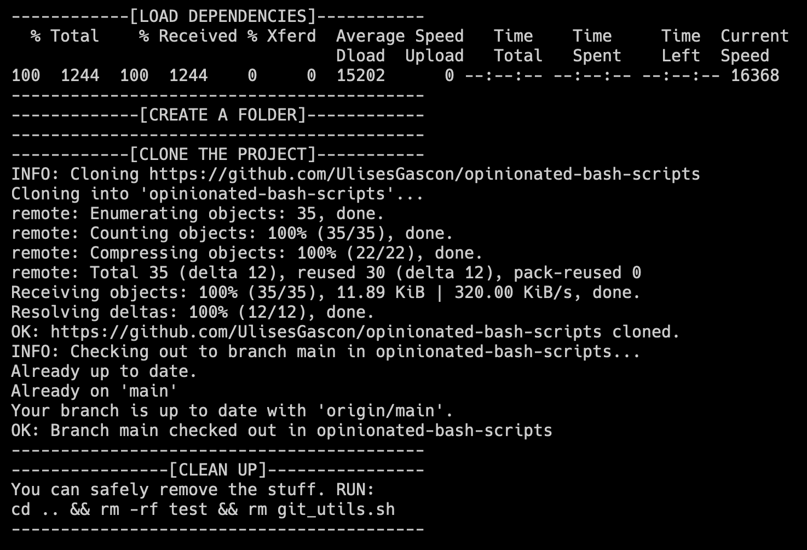

# Opinionated Bash Scripts

These are scripts that I use for my projects :rainbow:. 

They are opinionated and may not be useful for you, but feel free to use them as you wish, even if it's just for inspiration. :tanabata_tree:

## Usage

```bash
echo "------------[LOAD DEPENDENCIES]-----------"
curl https://raw.githubusercontent.com/UlisesGascon/opinionated-bash-scripts/main/scripts/git.sh --output git_utils.sh
source git_utils.sh
echo "------------------------------------------"

echo "-------------[CREATE A FOLDER]------------"
mkdir test
cd test
echo "------------------------------------------"

echo "------------[CLONE THE PROJECT]-----------"
git_clone_public_project https://github.com/UlisesGascon/opinionated-bash-scripts
git_checkout_branch opinionated-bash-scripts main
echo "------------------------------------------"

echo "----------------[CLEAN UP]----------------"
echo "You can safely remove the stuff. RUN:"
echo "cd .. && rm -rf test && rm git_utils.sh"
echo "------------------------------------------"
```

The output should be something like this:



Note: You can replace `curl` by copying the script and pasting it in your terminal.

## Contributing :steam_locomotive:

Feel free to open an issue if you have any questions or suggestions but please note that I may not be able to help you with your specific use case.

:warning: If you want to contribute code, please open a pull request. I will review it as soon as I can, but take into account that this is a side project and it is very opinionated, so I may not accept your changes if they don't fit my use case.
